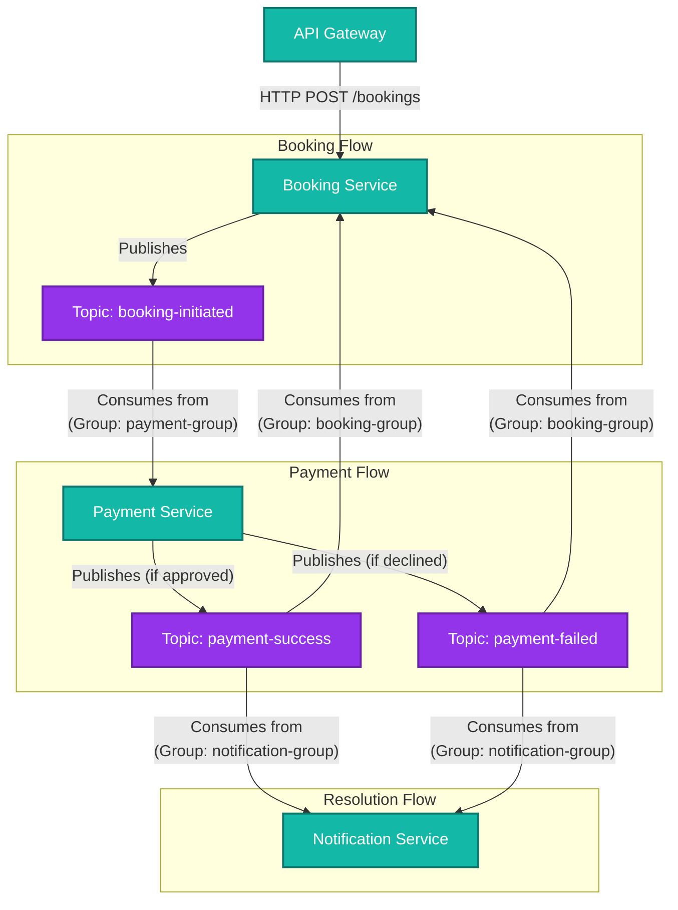

# Kafka Event-Driven Architecture

## 1. System Topology & Flow Diagram

Here is a diagram of exactly how the Kafka topics, producers, consumers, and consumer groups are modeled in Cineflow.

### Kafka Group Breakdown:
* **`payment-group`**: Used by the Payment Service to listen for new bookings. If you spin up 5 instances of the Payment Service, Kafka will load-balance the messages among them so that a single booking isn't paid for twice!
* **`booking-group`**: Used by the Booking Service to listen for payment results (so it can update the Postgres Database to `CONFIRMED` or `FAILED`).
* **`notification-group`**: Used by the Notification Service to listen for payment results (so it can send emails). 

*(Notice how both Booking and Notification services consume the exact same `payment-success` topic, but because they are in **different consumer groups**, Kafka ensures both services receive a copy of the message!)*

---

## 2. Why is Kafka needed for the Payment Service?

In older, synchronous architectures, the Booking Service would make a direct HTTP API call to the Payment Service, wait 5-10 seconds for the bank to respond, and then return the result to the user.

**Here is why that is dangerous, and why we use Kafka instead:**

> [!CAUTION]
> **The HTTP Timeout Problem**
> If thousands of people try to book *Spider-Man* at the same time, the Booking Service would have thousands of open HTTP connections waiting on the Payment Service. The Booking Service would quickly run out of memory and crash, taking down the entire platform.

By using Kafka, we gain **Decoupling and Asynchronous Processing**:

1. **Zero Blocking**: The Booking Service drops a message into Kafka (which takes 2 milliseconds) and immediately returns a `PENDING` state to the user. The Booking Service is instantly free to handle the next customer.
2. **Traffic Spikes (Buffering)**: If the Payment Service (or the external Bank API) gets overwhelmed, it won't crash the Booking Service. The `booking-initiated` messages just sit safely in the Kafka queue. The Payment Service will process them at its own pace without dropping a single payment.
3. **Resilience & Retries**: If the Payment Service crashes halfway through a payment, Kafka remembers that the message wasn't fully processed. When the Payment Service reboots, it picks up exactly where it left off.
4. **Extensibility**: Want to add a new "Analytics Service" that tracks successful payments? You don't need to touch the Payment Service code at all. Just spin up the new service and have it subscribe to the `payment-success` topic!
